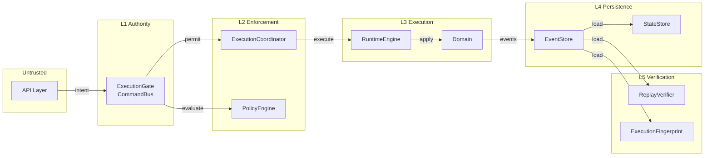
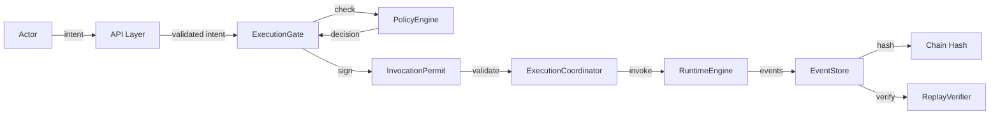
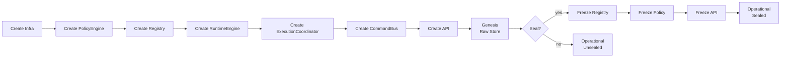
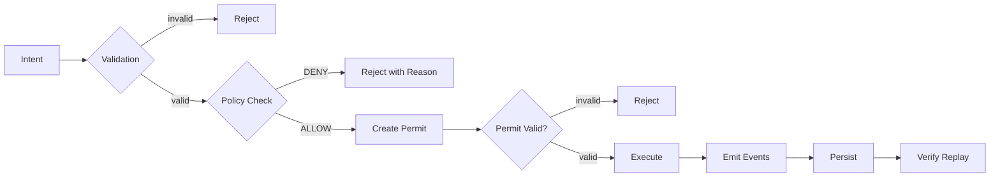
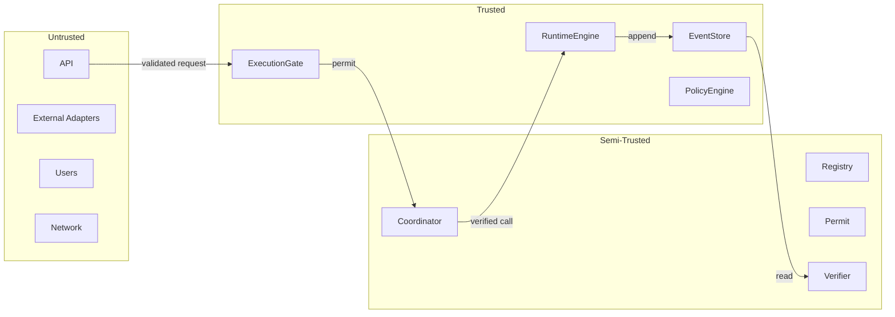

# 04 - System Overview

This document provides a high-level view of Synth's architecture, component interactions, and data flows. All diagrams use Mermaid horizontal flow notation.

## Overall Architecture

Synth is organized into five layers, each with a specific responsibility:

**Layer responsibilities:**

| Layer | Name | Responsibility |
|-------|------|---------------|
| L1 | Authority | Single mutation spine -- all state changes flow through here |
| L2 | Enforcement | Policy evaluation and permit validation before execution |
| L3 | Execution | Pure domain logic execution -- no decisions, only computation |
| L4 | Persistence | Append-only event log and state storage with integrity checks |
| L5 | Verification | Replay consistency and execution determinism verification |

## Execution Flow

An intent flows through the system in six phases:

**Phase details:**

| Phase | Component | Action |
|-------|-----------|--------|
| 1 | API Layer | Validates intent structure (required fields, types) |
| 2 | ExecutionGate | Creates InvocationPermit, evaluates policy |
| 3 | PolicyEngine | Returns ALLOW/DENY with attestation hashes |
| 4 | ExecutionCoordinator | Verifies permit signature, delegates to Runtime |
| 5 | RuntimeEngine | Executes domain logic, produces events |
| 6 | EventStore | Appends events with chain hashes, triggers replay verification |

## Bootstrap Flow

The system initializes through a carefully sequenced bootstrap process:

**Bootstrap sequence:**

1. **Infrastructure** -- Create event store, state store, partition store, checkpoint store
2. **Policy Engine** -- Register default policies (system protection, completed work protection)
3. **Capability Registry** -- Register built-in capabilities (CreateWorkItem [execution artifact], StartExpedition [planning capability], etc.)
4. **Runtime Engine** -- Create execution operator (internal only, not exported)
5. **Execution Coordinator** -- Create permit validator with unique gate key
6. **CommandBus** -- Wire all components into the single mutation authority
7. **API Layer** -- Create the public-facing request handler
8. **Genesis** -- Write initial events through the raw (unguarded) store
9. **Seal** (optional) -- One-way transition: freeze registry, policy engine, and API

## Governance Flow

Policy evaluation is a hard stop before execution:

**Key property:** A policy denial with `DENY` effect prevents execution entirely. The rejection includes the policy ID that caused the denial and the attestation hash of the decision.

## Trust Zones

The system has three trust zones:

**Zone properties:**

| Zone | Components | Compromise Impact |
|------|-----------|-------------------|
| Trusted | ExecutionGate, RuntimeEngine, EventStore, PolicyEngine | System integrity violated |
| Semi-Trusted | Registry, Coordinator, Permit, ReplayVerifier, Fingerprint | Degraded verification, but state remains safe |
| Untrusted | API, Users, External adapters, Network | No impact on kernel (all inputs validated) |

## Data Flow Summary

```mermaid
flowchart LR
    A[Intent] -->|1. validate| B[Validation]
    B -->|2. evaluate| C[PolicyEngine]
    C -->|3. permit| D[ExecutionGate]
    D -->|4. verify| E[Coordinator]
    E -->|5. execute| F[RuntimeEngine]
    F -->|6. produce| G[Events]
    G -->|7. hash| H[EventStore]
    H -->|8. derive| I[State]
    I -->|9. verify| J[ReplayVerifier]
```

All data flows unidirectionally. There are no feedback loops from execution back to validation. Each step transforms the data and passes it forward.

## Component Interaction Map

| Component | Receives From | Sends To | Purpose |
|-----------|--------------|----------|---------|
| API Layer | External requests | CommandBus | Validation and routing |
| CommandBus | API, direct calls | PolicyEngine, Coordinator, EventStore | Orchestrate execution |
| PolicyEngine | CommandBus | CommandBus | Authorization decisions |
| ExecutionCoordinator | CommandBus | RuntimeEngine | Permit validation |
| RuntimeEngine | Coordinator | Domain | Pure execution |
| Domain | RuntimeEngine | Events | State transition logic |
| EventStore | CommandBus (guarded) | ReplayVerifier, StateStore | Persistent log |
| ReplayVerifier | EventStore | Verification report | Consistency check |
| CapabilityRegistry | Bootstrap | CommandBus | Capability metadata |
| StateStore | Bootstrap/Operations | Load/Save | State persistence |

## Scaling Considerations

The architecture supports horizontal scaling at the partition level:

- Commands are routed to partitions by a partition key (e.g., entity ID)
- Commands within a partition execute sequentially (maintaining ordering)
- Different partitions execute concurrently
- The event log remains a single append-only sequence

This design allows throughput to increase with partition count while preserving the single mutation authority invariant within each partition.

## Related Documents

- [05 - Component Model](05-component-model.md) -- Detailed component descriptions
- [06 - Execution Lifecycle](06-execution-lifecycle.md) -- Bootstrap, seal, and operational phases
- [13 - Trust Boundaries](13-trust-boundaries.md) -- Complete trust model and threat analysis
