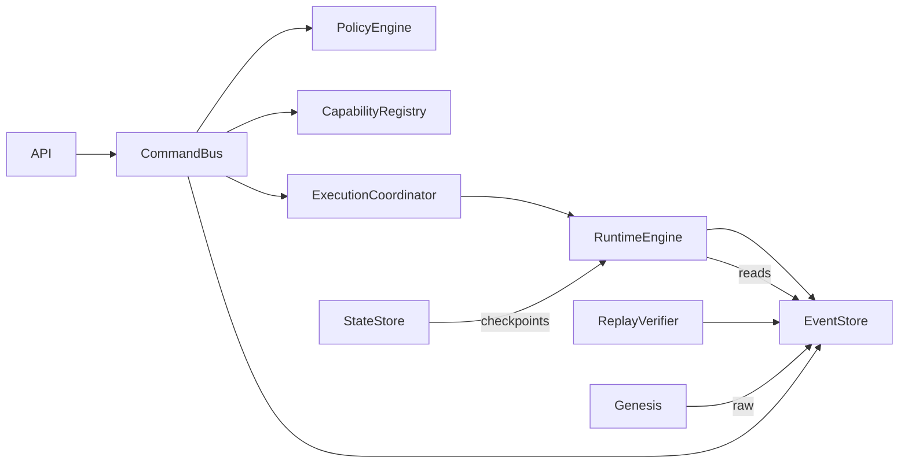

# 05 - Component Model

This document describes every major subsystem in Synth. Each component's description is implementation-independent.

---

## ExecutionGate (CommandBus)

**Purpose:** Single mutation authority. All state changes must flow through this component.

**Responsibilities:**
- Receive and validate intents
- Evaluate intents against policies
- Resolve capabilities
- Create invocation permits
- Delegate execution to the ExecutionCoordinator
- Persist emitted events through the guarded EventStore
- Compute execution fingerprints

**Public Interface:**
- `dispatch(intent)` -- primary entrypoint for mutations
- `drain()` -- wait for all pending operations to complete

**Dependencies:** RuntimeEngine, EventStore, PolicyEngine, CapabilityRegistry, ExecutionCoordinator

**Lifecycle:** Created during bootstrap. After seal, remains active and immutable.

**Failure Modes:**
- Policy denial -- intent rejected with reason and attestation
- Validation failure -- intent rejected before policy check
- Permit mismatch -- ExecutionCoordinator rejects (indicates tampering)
- Guard token conflict -- concurrent write attempt detected

**Architectural Constraints:**
- Must be the only component that activates the EventStore guard token
- Must create exactly one permit per successful dispatch
- Must attach a transaction ID to all emitted events

---

## ExecutionCoordinator

**Purpose:** Validate invocation permits before delegating to the RuntimeEngine.

**Responsibilities:**
- Verify permit signatures using the shared gate key
- Confirm permit matches the invocation (capability, actor)
- Reject execution if permit is invalid or mismatched
- Forward valid invocations to RuntimeEngine unchanged

**Public Interface:**
- `execute(permit, invocation)` -- validate permit, delegate to runtime

**Dependencies:** RuntimeEngine

**Lifecycle:** Created during bootstrap with a unique gate key shared with the CommandBus.

**Failure Modes:**
- Invalid signature -- permit was not created by this system's ExecutionGate
- Invocation mismatch -- permit capability/actor does not match invocation

**Architectural Constraints:**
- Must be the only component that verifies permits
- RuntimeEngine must not see or verify permits
- Gate key must never be exposed outside the bootstrap scope

---

## RuntimeEngine

**Purpose:** Pure execution operator. Applies domain logic to produce events.

**Responsibilities:**
- Receives pre-authorized invocations (no validation, no policy, no crypto)
- Loads current state from the event log
- Applies domain logic to produce events
- Returns events and transaction metadata

**Public Interface:**
- `execute(invocation)` -- apply domain logic, return events
- `getState()` -- return current state reconstructed from event log

**Dependencies:** EventStore (for state reconstruction)

**Lifecycle:** Created during bootstrap. Never exported from the bootstrap surface. Internal only.

**Failure Modes:**
- Domain invariant violation -- event violates domain rules (e.g., completing an unstarted work item)
- State reconstruction failure -- corrupted event log

**Architectural Constraints:**
- Must not validate input (that's the validator's job)
- Must not check policy (that's the policy engine's job)
- Must not verify permits (that's the coordinator's job)
- Must not write to the store (that's the CommandBus's job)
- Must be pure: given the same invocation and state, always produce the same events

---

## Domain

**Purpose:** Pure logic defining entity lifecycles and state transitions.

**Responsibilities:**
- Define entity constructors (work item, objective, expedition, mission)
- Define state transition functions (start, complete, block)
- Define event emission for each capability
- Enforce domain invariants (e.g., cannot complete a work item that is not active)

**Public Interface:**
- `applyDomain(intent, state)` -- pure function returning events
- Entity transition functions (e.g., `startWorkItem`, `completeWorkItem`)

**Dependencies:** None. The domain is pure logic.

**Lifecycle:** Stateless. Always available. Never changes at runtime.

**Failure Modes:**
- Domain invariant violation -- invalid state transition requested

**Architectural Constraints:**
- Must be side-effect free
- Must not access external state
- Must not produce nondeterministic output
- Must be a pure function of (intent, state) → events

---

## PolicyEngine

**Purpose:** Deterministic constraint evaluator. Decides whether intents are authorized.

**Responsibilities:**
- Register policies with conditions, effects, scopes, and severities
- Evaluate intents against all applicable policies
- Return ALLOW or DENY with attestation hashes
- Compute policy version hash

**Public Interface:**
- `isAllowed(intent, state)` -- evaluate intent, return decision with attestation
- `register(policy)` -- add a policy (pre-seal only)
- `computePolicyHash()` -- return hash of all active policies

**Dependencies:** None (self-contained)

**Lifecycle:** Created during bootstrap with default policies. Frozen at seal.

**Failure Modes:**
- Policy conflict -- multiple policies match with different effects
- Post-seal registration attempt -- throws invariant violation

**Architectural Constraints:**
- Must be frozen after seal
- Must evaluate deterministically: same (intent, state, policies) → same decision
- Must include attestation hashes in every decision

---

## CapabilityRegistry

**Purpose:** Maintains the catalog of registered capabilities.

**Responsibilities:**
- Register capabilities with schemas, preconditions, and metadata
- Resolve capability names to capability definitions
- List available capabilities

**Public Interface:**
- `register(capability)` -- add a capability (pre-seal only)
- `resolve(name)` -- look up a capability by name
- `has(name)` -- check if a capability exists
- `list()` -- return all registered capability names

**Dependencies:** None (self-contained)

**Lifecycle:** Created during bootstrap with built-in capabilities. Frozen at seal.

**Failure Modes:**
- Unknown capability -- intent references a non-existent capability
- Post-seal registration attempt -- throws invariant violation

**Architectural Constraints:**
- Must be frozen after seal
- Must not allow duplicate registrations
- Must return a known result for unknown capabilities (noop, not error)

---

## EventStore

**Purpose:** Append-only log of all system events with chain hash integrity.

**Responsibilities:**
- Append single events
- Append batches of events
- Load all events
- Compute chain hashes for each event
- Verify chain integrity

**Public Interface:**
- `append(event)` -- append one event with chain hash
- `appendBatch(events)` -- append multiple events with chain hashes
- `loadAll()` -- return all events in order
- `verifyChain()` -- validate chain hash integrity

**Dependencies:** Persistence layer (filesystem or database)

**Lifecycle:** Created during bootstrap. Active for the system lifetime.

**Failure Modes:**
- Chain break -- an event's previousHash does not match the preceding event's eventHash
- Guard rejection -- write attempted without active guard token
- Storage failure -- underlying persistence layer error

**Architectural Constraints:**
- Must be append-only (no update, delete, or rewrite)
- Must reject writes without an active guard token
- Must compute chain hashes atomically with writes
- Must preserve event order

---

## ReplayVerifier

**Purpose:** Verify that replaying the event log produces consistent state.

**Responsibilities:**
- Load all events from the EventStore
- Reconstruct state by folding events through domain logic
- Compare reconstructed state hash to expected hash
- Report inconsistencies

**Public Interface:**
- `verify()` -- replay events, check consistency, return report
- `getStats()` -- return event and entity counts

**Dependencies:** EventStore

**Lifecycle:** Created during bootstrap. Available for on-demand verification.

**Failure Modes:**
- Replay hash mismatch -- state does not match expected
- Invalid entity state -- entity in impossible state

**Architectural Constraints:**
- Must use the same domain logic as the RuntimeEngine
- Must not modify state or events
- Must report all issues, not just the first

---

## StateStore

**Purpose:** Persistent storage for canonical state snapshots with integrity verification.

**Responsibilities:**
- Save state with a cryptographic hash
- Load state and verify hash integrity
- Reject tampered state files

**Public Interface:**
- `save(state)` -- persist state with hash envelope
- `load()` -- load state, verify hash, return or reject

**Dependencies:** Persistence layer

**Lifecycle:** Created during bootstrap. Used for checkpointing state.

**Failure Modes:**
- Hash mismatch -- stored hash does not match recomputed hash (tampering detected)
- Missing state -- no state file exists

**Architectural Constraints:**
- Must store state with a hash envelope
- Must verify hash on load
- Must reject, not warn, on hash mismatch

---

## Genesis

**Purpose:** Initialize the event log before the execution pipeline is fully operational.

**Responsibilities:**
- Write the SYSTEM_GENESIS event through the raw (unguarded) store
- Write initial projects, tickets, and other seed data
- Return the genesis result for verification

**Public Interface:**
- `initialize(config)` -- write genesis events, return seed report

**Dependencies:** Raw EventStore (not the guarded store), CapabilityRegistry

**Lifecycle:** Used once during bootstrap. After genesis completes, the raw store is sealed.

**Failure Modes:**
- Storage failure during seed writes
- Invalid genesis configuration

**Architectural Constraints:**
- Must use the raw store, not the guarded store
- Must complete before operational mode begins
- Must not be repeatable

---

## Bootstrap

**Purpose:** Create and wire all system components into a functional execution kernel.

**Responsibilities:**
- Create infrastructure (stores, directories)
- Create and configure all components
- Wire dependencies between components
- Execute genesis if configured
- Return the operational system surface (excluding RuntimeEngine)

**Public Interface:**
- `bootstrap(config)` -- create, wire, and return system

**Dependencies:** All components

**Lifecycle:** Runs once at system startup. Produces the operational system.

**Failure Modes:**
- Component creation failure
- Genesis failure
- Invariant violation during initialization

**Architectural Constraints:**
- Must not export RuntimeEngine
- Must return seal() function for one-way transition
- Must verify I1 (single authority) before returning

---

## API Layer

**Purpose:** Public interface for external requests.

**Responsibilities:**
- Receive intents from external actors
- Validate intent structure
- Delegate to CommandBus
- Format responses with metadata (trace IDs, fingerprints, attestations)
- Handle and translate errors

**Public Interface:**
- `handleIntent(request)` -- validate and dispatch intent, return response

**Dependencies:** CommandBus

**Lifecycle:** Created during bootstrap. Frozen at seal.

**Failure Modes:**
- Validation failure -- malformed request
- Policy denial -- intent not authorized
- Execution error -- runtime failure

**Architectural Constraints:**
- Must validate before delegating to CommandBus
- Must not access RuntimeEngine directly
- Must be frozen after seal

---

## ExecutionFingerprint

**Purpose:** Provide a deterministic proof of execution.

**Responsibilities:**
- Hash the normalized execution record (command, events, result)
- Enable comparison of executions across replays

**Public Interface:**
- `create(record)` -- return SHA-256 fingerprint of normalized record

**Dependencies:** None (pure computation)

**Lifecycle:** Stateless. Used during CommandBus dispatch.

**Failure Modes:**
- None (pure function)

**Architectural Constraints:**
- Must produce identical hashes for identical executions
- Must produce different hashes for different executions
- Must normalize input (sort keys, stable ordering) before hashing

---

## InvocationPermit

**Purpose:** Cryptographically signed authorization for a specific execution.

**Responsibilities:**
- Create signed permits using HMAC-SHA256
- Verify permits against the shared gate key
- Bind permit to specific invocation (capability, actor)

**Public Interface:**
- `create(txId, invocation, gateKey)` -- create signed permit
- `verify(permit, gateKey)` -- verify permit signature and match

**Dependencies:** Cryptographic primitives (HMAC-SHA256)

**Lifecycle:** Created per-dispatch. Immutable once created.

**Failure Modes:**
- Invalid signature -- permit was forged or created by different system
- Invocation mismatch -- permit does not match the invocation being executed

**Architectural Constraints:**
- Must be immutable
- Must be bound to a specific transaction ID
- Must include timestamp for temporal validation
- Gate key must never be exposed

---

## Component Dependency Graph

**Key observation:** The RuntimeEngine (RE) has only one incoming arrow from the ExecutionCoordinator, and only reads from the EventStore. It is isolated from the API, CommandBus, and external callers.

## Related Documents

- [04 - System Overview](04-system-overview.md) -- High-level architecture with diagrams
- [06 - Execution Lifecycle](06-execution-lifecycle.md) -- How components interact over time
- [17 - Runtime Invariants](17-runtime-invariants.md) -- Invariants enforced by each component
