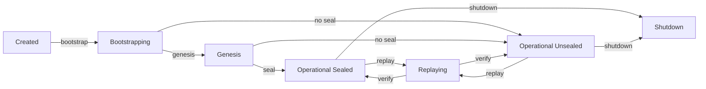
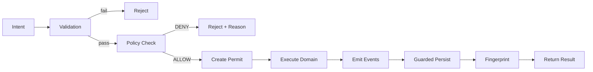

# 06 - Execution Lifecycle

This document describes every phase of the system's lifecycle: from initial bootstrap through operational mode, replay, and shutdown.

## Lifecycle States

The system has five distinct lifecycle states:

| State | Description |
|-------|-------------|
| Created | Components exist but are not wired |
| Bootstrapping | Components are being created and wired |
| Genesis | Initial events are being written to the raw store |
| Operational | System accepts and executes intents |
| Replaying | System is verifying state by replaying events |
| Shutdown | System is terminating cleanly |

## Phase 1: Bootstrap

**Purpose:** Create and wire all components into a functional execution kernel.

**Allowed Operations:**
- Component creation and configuration
- Policy registration
- Capability registration
- Store initialization

**Forbidden Operations:**
- Intent execution (execution pipeline not yet active)
- Direct store writes (guard not yet configured)

**Sequence:**

1. **Create Infrastructure** -- EventStore, StateStore, PartitionStore, CheckpointStore
2. **Create PolicyEngine** -- with default policies
3. **Create CapabilityRegistry** -- with built-in capabilities
4. **Create RuntimeEngine** -- internal only, not exported
5. **Create ExecutionCoordinator** -- with unique gate key
6. **Create CommandBus** -- wired with all components
7. **Create API** -- wired to CommandBus

**Output:** System in pre-seal state with all components wired.

**Transition Rules:**
- Must complete successfully before any other phase
- May proceed directly to Genesis, or skip to Operational (unsealed)
- Cannot be repeated without full system restart

## Phase 2: Genesis

**Purpose:** Initialize the event log with system and seed data before operational mode.

**Allowed Operations:**
- Write to raw (unguarded) EventStore
- Register seed capabilities
- Create initial entities (missions, work items)

**Forbidden Operations:**
- Write to guarded EventStore (guard not active during genesis)
- Execute capabilities through the execution pipeline
- Seal the system (must happen after genesis)

**Sequence:**

1. **Write SYSTEM_GENESIS event** -- marks the beginning of the event log
2. **Write initial projects** -- PROJECT_CREATED events
3. **Write initial work items** -- WORK_ITEM_GENERATED events
4. **Write initial capabilities** -- capability registration events (if applicable)

**Output:** Event log containing genesis events. System remains in pre-seal state.

**Key Property:** Genesis is the only time events are written outside the guarded store. This is necessary because the execution pipeline (including the guard) is not fully active during genesis.

**Why Genesis Exists:** The system needs seed data (system identifier, initial entities) before it can accept operational commands. Genesis provides a privileged initialization phase that populates the event log without requiring the full execution pipeline.

**Why Genesis Cannot Be Repeated:** Genesis events are written through the raw store, bypassing the guard. Repeating genesis would allow unguarded writes after the system is operational, violating I3 (no unauthorized mutation).

## Phase 3: Seal

**Purpose:** One-way transition from flexible bootstrap mode to locked operational mode.

**Allowed Operations (during seal):**
- Freeze capability registry
- Freeze policy engine
- Freeze API surface
- Verify invariants I1 and I5

**Forbidden Operations:**
- Register new capabilities
- Register new policies
- Modify API surface
- Unseal (seal is irreversible without restart)

**Sequence:**

1. **Freeze CapabilityRegistry** -- `_frozen = true`; subsequent registration attempts throw
2. **Freeze PolicyEngine** -- `_frozen = true`; subsequent registration attempts throw
3. **Freeze API** -- `Object.freeze(api)`; prevents monkey-patching
4. **Verify I1** -- confirm CommandBus is the single mutation authority
5. **Verify I5** -- confirm capability registry is immutable

**Output:** System in sealed operational state.

**Transition Rules:**
- Seal is optional (system can operate unsealed)
- Once sealed, cannot be unsealed without full restart
- Double-seal throws InvariantViolation

**Why Seal Matters:** An unsealed system allows runtime modification of capabilities, policies, and API surface. This is useful for development but dangerous in production. Seal provides a clear boundary between configuration time and runtime.

## Phase 4: Operational Mode

**Purpose:** Accept and execute intents from actors.

**Allowed Operations:**
- `api.handleIntent(request)` -- public API entrypoint
- `bus.dispatch(intent)` -- direct CommandBus dispatch (advanced use)
- `replayVerifier.verify()` -- on-demand consistency check
- Read operations on all stores

**Forbidden Operations:**
- Register new capabilities (I5 violation)
- Register new policies (I5 violation)
- Direct EventStore writes without guard (I3 violation)
- Access RuntimeEngine directly (structurally prevented)

**Execution Sequence:**

**State Changes:**
- Event log grows by one or more events per successful dispatch
- State changes only as a result of event log growth
- Mutation count increments

**Invariant Enforcement:**
- I1: Only CommandBus dispatches mutations
- I2: All events have transaction IDs
- I3: All writes pass through guard
- I5: Registry and policy engine are frozen

## Phase 5: Replay

**Purpose:** Verify system integrity by reconstructing state from events.

**Allowed Operations:**
- Load all events from EventStore
- Reconstruct state by folding events
- Compare state hash to expected value
- Verify chain hash integrity

**Forbidden Operations:**
- Modify events
- Modify state
- Write to stores
- Execute new intents

**Sequence:**

1. **Load Events** -- read entire event log
2. **Verify Chain** -- check that all chain hashes link correctly
3. **Reconstruct State** -- apply each event to initial state in order
4. **Compute Hash** -- hash the reconstructed state
5. **Compare** -- match against expected hash

**Output:** Verification report indicating consistency or issues found.

**When Replay Runs:**
- On-demand (explicit verification request)
- After batch event writes (background verification)
- On system startup (integrity check before accepting operations)

## Phase 6: Shutdown

**Purpose:** Terminate the system cleanly.

**Allowed Operations:**
- Drain pending operations (wait for in-flight dispatches)
- Flush state to StateStore
- Close persistence connections

**Forbidden Operations:**
- Accept new intents
- Write to EventStore
- Modify any component

**Sequence:**

1. **Drain Queue** -- wait for all pending CommandBus dispatches
2. **Checkpoint State** -- save current state with hash
3. **Close Stores** -- flush and close persistence
4. **Release Resources** -- clean up any held resources

## State Transition Matrix

| From | To | Trigger | Allowed |
|------|-----|---------|---------|
| Created | Bootstrapping | `bootstrap()` call | Yes |
| Bootstrapping | Genesis | Genesis config present | Yes |
| Bootstrapping | Operational Unsealed | Skip genesis, no seal | Yes |
| Genesis | Operational Unsealed | Skip seal | Yes |
| Genesis | Operational Sealed | `seal()` call | Yes |
| Operational Unsealed | Operational Sealed | `seal()` call | Yes |
| Operational Sealed | Replaying | `replay()` call | Yes |
| Operational Unsealed | Replaying | `replay()` call | Yes |
| Replaying | Operational Sealed | Verification complete | Yes |
| Replaying | Operational Unsealed | Verification complete | Yes |
| Operational Sealed | Shutdown | `shutdown()` call | Yes |
| Operational Unsealed | Shutdown | `shutdown()` call | Yes |

**Forbidden Transitions:**
- Operational → Bootstrapping (bootstrap is once-only)
- Operational → Genesis (genesis is once-only)
- Sealed → Unsealed (seal is one-way)
- Any → Direct Runtime Access (structurally impossible)

## Related Documents

- [05 - Component Model](05-component-model.md) -- Component descriptions
- [15 - Bootstrap and Genesis](15-bootstrap-genesis.md) -- Detailed bootstrap and genesis documentation
- [17 - Runtime Invariants](17-runtime-invariants.md) -- Invariants enforced at each lifecycle phase
