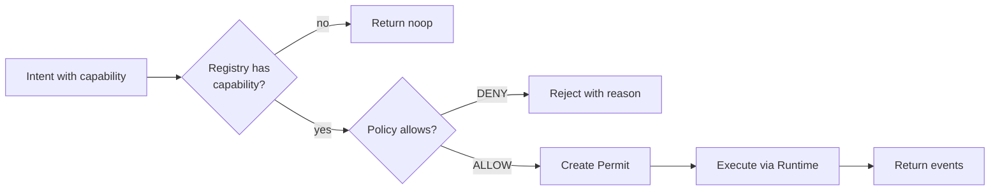

> **Note:** The capabilities listed below are execution-level artifacts. The planning model (Mission → Expedition → Objective → Work Item) produces these artifacts through the Planning Cognition Engine. See [Artifact Independence](../guides/philosophy/01-engineering-philosophy.md).

# 07 - Capability Model

Capabilities are the fundamental unit of action in Synth. Every mutation is performed through a registered capability. This document describes how capabilities work, how they are registered, discovered, executed, and isolated.

## Two Capability Layers

SYNTH distinguishes two capability layers:

| Layer | Purpose | State effect | Governance |
|-------|---------|--------------|------------|
| **Domain capabilities** | Mutate canonical state (Work Items, Plans, Milestones, Projects) | Emit events through the ExecutionGate | Capability Registry, frozen at seal; PolicyEngine authorization |
| **Environment capabilities** | Describe and interact with the execution environment | Never mutate canonical state; produce replayable discovery evidence | Environment Layer ([ADR-006](../adr/ADR-006-environment-discovery-framework.md)), Capability Graph ([ADR-007](../adr/ADR-007-capability-graph-model.md)) |

This page primarily describes domain capabilities. Environment capabilities — the twelve canonical families such as Workspace, Filesystem, Revision, and Forge — are enumerated in the [Capability Reference](../reference/capability-reference.md) and governed by [ADR-006](../adr/ADR-006-environment-discovery-framework.md) through [ADR-017](../adr/ADR-017-constitutional-compliance-core-boundary.md).

## What Is a Capability?

A capability is a named, versioned contract between the system and its users. It declares:

- **Name** -- unique identifier (e.g., `StartWorkItem`, `CreateProject`)
- **Input Schema** -- what the capability accepts (field names and types)
- **Output Schema** -- what events the capability produces
- **Preconditions** -- required system state for the capability to be valid
- **Side Effects** -- whether the capability mutates state (true for all domain capabilities)

Capabilities transform the system from "everything is permitted unless denied" to "nothing is permitted unless explicitly registered."

## Capability Registration

Capabilities are registered during bootstrap. The registry is frozen at seal.

### Registration Rules

- A capability can only be registered once (no duplicates)
- Registration is only allowed before seal
- Post-seal registration throws InvariantViolation I5
- Unknown capabilities dispatched through the CommandBus result in a noop (not an error)

### Built-in Capabilities

| Capability | Input | Output Events | Preconditions |
|------------|-------|---------------|---------------|
| CreateTicket | id, name, [status] | TICKET_CREATED | None |
| StartTicket | id | TICKET_STARTED | Ticket exists, status is idle |
| CompleteTicket | id | TICKET_COMPLETED | Ticket exists, status is active |
| BlockTicket | id, reason | TICKET_BLOCKED | Ticket exists |
| CreatePlan | id, name | PLAN_CREATED | None |
| ActivatePlan | id | PLAN_ACTIVATED | Plan exists, status is draft |
| CompletePlan | id | PLAN_COMPLETED | Plan exists, status is active |
| CreateMilestone | id, planId, name | MILESTONE_CREATED | Plan exists |
| StartMilestone | id | MILESTONE_STARTED | Milestone exists, status is pending |
| CompleteMilestone | id | MILESTONE_COMPLETED | Milestone exists, status is in_progress |
| CreateProject | id, name, goal | PROJECT_CREATED | None |

## Capability Discovery

The system provides two mechanisms for discovering capabilities:

1. **Registry Listing** -- `registry.list()` returns all registered capability names
2. **Runtime Resolution** -- `registry.resolve(name)` returns the capability definition or null

This enables dynamic capability routing and runtime introspection.

## Capability Execution

When an intent is dispatched, the CommandBus resolves the capability and executes it:

**Execution semantics:**
- If the capability is not registered, the dispatch returns a noop (empty event set)
- If the capability is registered but policy denies it, the dispatch is rejected with a PolicyBlockedError
- If the capability is registered and policy allows, the domain logic is executed and events are emitted

## Capability Isolation

Capabilities are isolated from each other. Each capability:

- Has its own input validation schema
- Produces its own event types
- Operates on its own entity type (ticket, plan, milestone, project)
- Cannot directly invoke another capability

Cross-capability effects occur only through the shared state of entities. For example, `CompleteWorkItem` and `StartWorkItem` both operate on the `WorkItem` entity, but they are separate capabilities with separate validation, policy evaluation, and execution paths.

## The Capability Graph

The Environment Layer models environment capabilities as a directed, acyclic **Capability Graph** ([ADR-007](../adr/ADR-007-capability-graph-model.md)):

- **Capability nodes** — one per canonical family (`cap:Filesystem`, `cap:Revision`, ...). Each records its family, schema version, whether it is required for execution, and human-readable metadata.
- **Provider nodes** — concrete providers (`prov:git-revision`, `prov:node-filesystem`, ...) that satisfy one or more families.
- **`satisfies` edges** — provider → capability: the provider can satisfy the capability.
- **`requires` edges** — capability → capability: a capability depends on another (for example, Forge requires Revision and Network; Revision requires Filesystem).

The graph is serializable, versioned, and replayable. Provider resolution is deterministic: identical discovery evidence always selects the same providers. Resolution failures are recorded as first-class graph artifacts rather than thrown as ambient errors.

The canonical family catalog and dependency edges live in `src/environment/graph.ts`; the family list and provider contracts are documented in the [Capability Reference](../reference/capability-reference.md).

## Capability Extension

New capabilities can be added by:

1. **Defining the capability** -- name, input schema, output events, preconditions
2. **Registering the capability** -- during bootstrap, before seal
3. **Implementing domain logic** -- state transition function for the capability
4. **Adding policy rules** -- if the capability needs governance constraints

See [16 - Extension Model](16-extension-model.md) for detailed extension procedures.

## Capability Permissions

Capabilities do not have their own permission model. Authorization is handled by the PolicyEngine, not by the capability itself. This separation means:

- The same capability can have different policies in different deployments
- Policy changes do not require capability changes
- Policy evaluation is logged and attested; capability execution is not

## Future Plugin Support

The capability model is designed to support dynamic plugins in future versions:

- Capabilities can be loaded from external definitions
- Domain logic can be registered at runtime (before seal)
- Policy rules can reference capabilities by name

The freeze-after-seal mechanism ensures that dynamic loading does not compromise operational stability.

## Related Documents

- [05 - Component Model](05-component-model.md) -- CapabilityRegistry description
- [08 - Governance](08-governance.md) -- How policies govern capabilities
- [16 - Extension Model](16-extension-model.md) -- Adding new capabilities
- [Capability Reference](../reference/capability-reference.md) -- Domain and environment capability families
- [ADR-006](../adr/ADR-006-environment-discovery-framework.md) -- Environment Discovery Framework
- [ADR-007](../adr/ADR-007-capability-graph-model.md) -- Capability Graph Model
- [ADR-017](../adr/ADR-017-constitutional-compliance-core-boundary.md) -- Constitutional Compliance and Core Boundary
