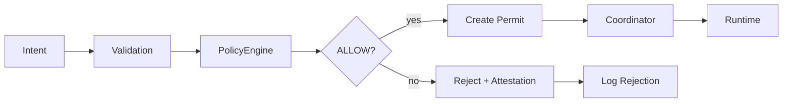

# 08 - Governance

Governance in Synth is not a layer on top of execution. It is a structural property of execution itself. Every mutation is evaluated against explicit policies before it is permitted to proceed. This document describes how policy evaluation, permit generation, and attestation work.

## Governance Architecture



**Key principle:** Policy evaluation is a hard stop. A policy with `DENY` effect prevents execution entirely. There is no override, no exception, no bypass.

## Policy Structure

A policy has the following attributes:

| Attribute | Description |
|-----------|-------------|
| id | Unique identifier (e.g., `system-protection`) |
| name | Human-readable name |
| scope | Which capabilities and actors the policy applies to |
| condition | Function that determines if the policy matches an intent |
| effect | `ALLOW` or `DENY` |
| severity | `critical`, `high`, `medium`, `low`, `informational` |
| enabled | Whether the policy is active |

## Policy Evaluation

When an intent is evaluated:

1. All active policies are checked against the intent's capability and actor
2. Policies that do not match the scope are skipped
3. The condition function is evaluated for matching policies
4. Results are sorted by severity (critical first)
5. The highest-severity `DENY` determines the outcome
6. If no `DENY` matches, the intent is allowed

**Evaluation rules:**

- A single `DENY` is sufficient to reject an intent
- Multiple `ALLOW` policies do not override a `DENY`
- Severity determines precedence when multiple policies match
- Policies are evaluated in deterministic order (by registration)

## Default Policies

Two policies are registered by default:

### System Protection Policy

```
id: system-protection
effect: DENY
severity: critical
scope: capabilities [DeleteSystem, ResetState, WipeData]
condition: always matches
```

This policy blocks destructive system operations unconditionally.

### Completed Work Protection Policy

```
id: completed-work-protection
effect: DENY
severity: high
scope: capabilities [StartWorkItem, BlockWorkItem, ResetWorkItem]
condition: work item status is "complete"
```

This policy prevents modification of completed work items.

## Policy Identity with Hashes

Synth uses hash-based policy identity instead of version numbers:

### Policy Version Hash

A SHA-256 hash of all active policies, computed as:

```
SORT( FOR EACH active policy: "{id}:{effect}:{severity}" )
JOIN(";")
SHA-256(result)
```

This hash changes if any policy is added, removed, or modified. It provides a single identifier for the entire policy configuration.

### Decision Hash

A SHA-256 hash of the specific decision inputs:

```
SHA-256( { intent: { capability, actor }, matchedPolicies: [...] } )
```

This hash uniquely identifies a specific policy decision. It changes if the intent, the matched policies, or their results change.

### Why Hashes Instead of Versions

- **Versions** are human-managed and can be skipped or duplicated
- **Hashes** are mathematical and change automatically when content changes
- A one-character change in any policy changes the version hash
- This makes policy drift detectable and tamper-evident

## Invocation Permits

When policy evaluation returns `ALLOW`, the ExecutionGate creates an InvocationPermit:

### Permit Structure

| Field | Description |
|-------|-------------|
| txId | Unique transaction identifier |
| capability | Name of the capability being invoked |
| actor | Identity of the invoking actor |
| payload | The intent payload |
| timestamp | Time of permit creation (ms since epoch) |
| signature | HMAC-SHA256 signature |

### Signature Computation

```
payload = "{txId}:{capability}:{actor}:{timestamp}"
signature = HMAC-SHA256(gateKey, payload)
```

The gate key is a 256-bit random value generated during bootstrap. It is shared between the ExecutionGate and the ExecutionCoordinator but never exposed outside the bootstrap scope.

### Permit Verification

The ExecutionCoordinator verifies the permit before delegating to Runtime:

1. Recompute the expected signature using the gate key
2. Compare with the permit's signature
3. Verify the permit's capability matches the invocation
4. Verify the permit's actor matches the invocation

Any mismatch results in an InvariantViolation, indicating potential tampering.

## Attestation

Every policy decision includes an attestation object:

### For ALLOW Decisions

```
attestation: {
    policyHash: "<policy version hash>",
    decisionHash: "<decision hash>"
}
```

### For DENY Decisions

```
attestation: {
    policyId: "<denying policy id>",
    policyHash: "<policy version hash>",
    decisionHash: "<decision hash>"
}
```

## Governance Invariants

| Invariant | Description |
|-----------|-------------|
| G1 | Every mutation is evaluated against all active policies |
| G2 | A DENY effect from any policy prevents execution |
| G3 | Policy evaluation is deterministic for the same (intent, state, policies) |
| G4 | Policy decisions include attestation hashes |
| G5 | Invocation permits are cryptographically signed |
| G6 | Permits are validated before execution |
| G7 | The policy engine is frozen after seal |

## Examples

### Valid Execution (Allowed)

```
Intent: StartWorkItem(id="W-1") by actor "user-1"
Policy Check: No DENY matches, ALLOW
Permit: Created with HMAC-SHA256 signature
Execution: Runtime executes, produces TICKET_STARTED event
Attestation: { policyHash: "abc123...", decisionHash: "def456..." }
```

### Invalid Execution (Denied)

```
Intent: StartWorkItem(id="W-1") by actor "user-1"
State: Work Item W-1 has status "complete"
Policy Check: completed-work-protection DENY matches
Result: Rejected with reason "Denied by policy: completed-work-protection"
Attestation: { policyId: "completed-work-protection", policyHash: "abc123...", decisionHash: "ghi789..." }
```

### Permit Mismatch (Tampering Detected)

```
Permit: capability="StartWorkItem", actor="user-1"
Invocation: capability="DeleteSystem", actor="hacker"
Coordinator: Signature valid but capability mismatch
Result: InvariantViolation("P1") -- execution rejected
```

## Related Documents

- [07 - Capability Model](07-capability-model.md) -- How capabilities relate to governance
- [14 - Security](14-security.md) -- Security mechanisms including permits and attestation
- [17 - Runtime Invariants](17-runtime-invariants.md) -- Governance-related invariants
