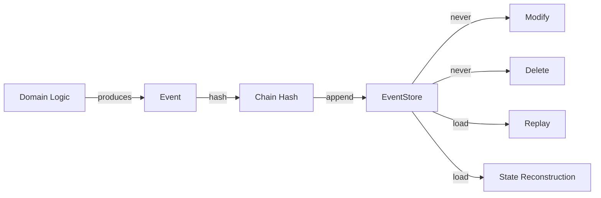

> **Note:** Event types with `TICKET_` prefix are execution artifact events. They represent projections of planning intent onto execution artifacts. The canonical planning model uses Mission → Expedition → Objective → Work Item. Events are implementation-level projections, not planning entities. See [Artifact Independence](../guides/philosophy/01-engineering-philosophy.md).

# 09 - Event Model

The event model is the foundation of Synth's determinism, replay, and audit capabilities. This document describes event structure, lifecycle, hash chaining, and integrity verification.

## Event Structure

Every event in the system has the following fields:

| Field | Type | Description |
|-------|------|-------------|
| id | string | Unique event identifier (UUID) |
| type | string | Event type (e.g., `TICKET_STARTED`) |
| timestamp | number | Event creation time (ms since epoch) |
| transactionId | string | ID of the transaction that produced this event |
| capability | string | Name of the capability that produced this event |
| actor | string | Identity of the actor who initiated the action |
| payload | object | Event-specific data |
| previousHash | string | Hash of the preceding event (chain linking) |
| eventHash | string | Cryptographic hash of this event |

**Example event:**

```
{
    id: "evt-12345678",
    type: "TICKET_STARTED",
    timestamp: 1700000000000,
    transactionId: "tx-abcdefgh",
    capability: "StartTicket",
    actor: "user-1",
    payload: { id: "T-1", status: "active" },
    previousHash: "abc123...def",
    eventHash: "fed321...cba"
}
```

## Event Types

### Domain Events

| Event Type | Entity | Description |
|------------|--------|-------------|
| TICKET_CREATED | Ticket | New ticket created |
| TICKET_STARTED | Ticket | Ticket transitioned to active |
| TICKET_COMPLETED | Ticket | Ticket transitioned to complete |
| TICKET_BLOCKED | Ticket | Ticket transitioned to blocked |
| PLAN_CREATED | Plan | New plan created |
| PLAN_ACTIVATED | Plan | Plan transitioned to active |
| PLAN_COMPLETED | Plan | Plan transitioned to completed |
| MILESTONE_CREATED | Milestone | New milestone created |
| MILESTONE_STARTED | Milestone | Milestone transitioned to in_progress |
| MILESTONE_COMPLETED | Milestone | Milestone transitioned to completed |
| PROJECT_CREATED | Project | New project created |

### Governance Events

Governance events record lifecycle transitions for Missions and Expeditions. They are the canonical source of truth for governance state and must be replayable.

| Event Type | Entity | Description |
|------------|--------|-------------|
| MISSION_CREATED | Mission | New mission drafted |
| MISSION_APPROVED | Mission | Mission approved for execution |
| MISSION_COMPLETED | Mission | Mission marked complete |
| MISSION_ARCHIVED | Mission | Mission archived |
| EXPEDITION_CREATED | Expedition | New expedition drafted under a mission |
| EXPEDITION_APPROVED | Expedition | Expedition approved for commitment |
| EXPEDITION_COMMITTED | Expedition | Expedition committed as runtime entity |
| EXPEDITION_STARTED | Expedition | Expedition execution started |
| EXPEDITION_COMPLETED | Expedition | Expedition execution completed |
| OBJECTIVE_ADDED | Objective | Objective added to an expedition |

### First Contact Events

| Event Type | Description |
|------------|-------------|
| FIRST_CONTACT_STARTED | Greenfield discovery session began |
| DISCOVERY_APPROVED | Discovery artifact approved |
| MISSION_MATERIALIZED | Mission created from approved discovery |
| EXPEDITIONS_PROPOSED | Initial expeditions proposed for a mission |

### Execution Intent Events

| Event Type | Description |
|------------|-------------|
| EXECUTION_INTENT_CREATED | Intent to execute a capability |
| EXECUTION_INTENT_GRAPH_CREATED | Dependency graph of execution intents |
| EXPEDITION_BRANCH_CREATED | Branch created for expedition execution |
| EXECUTION_INTENT_STARTED | Intent execution started |
| EXECUTION_INTENT_COMPLETED | Intent execution completed |
| EXECUTION_INTENT_FAILED | Intent execution failed |
| EXECUTION_INTENT_ROLLEDBACK | Intent execution rolled back |
| EXPEDITION_EXECUTION_COMMITTED | Expedition execution committed |
| EXPEDITION_EXECUTION_PROJECTED | Expedition output projected (PR/patch/diff) |

### System Events

| Event Type | Description |
|------------|-------------|
| SYSTEM_GENESIS | System initialization marker |

## Event Lifecycle

Events are created, persisted, and never modified:



**Immutable after creation:** Events are never modified, updated, or deleted. They are append-only.

## Hash Chaining

Every event (except genesis events written through the raw store) contains two hash fields that create a cryptographic chain:

### Chain Hash Computation

```
previousHash = lastEventHash || "genesis"
eventData = canonicalize({ ...eventFields, previousHash })
eventHash = SHA-256(eventData)
```

Where `canonicalize` means:
- Sort all object keys alphabetically
- Use stable array ordering
- Use consistent number formatting
- Produce deterministic string output

### Chain Properties

- The first operational event has `previousHash = "genesis"`
- Each subsequent event links to its predecessor via `previousHash`
- Tampering with any event invalidates all subsequent chain hashes
- The chain is verified by `EventStore.verifyChain()`

### Verification

```
FOR EACH hashed event at index i (starting from 1):
    EXPECT event[i].previousHash == event[i-1].eventHash
    IF mismatch:
        REPORT chain break at index i
```

## Event Integrity

### Tamper Detection

If an event is modified:

1. Its `eventHash` no longer matches its content
2. The next event's `previousHash` no longer matches
3. `verifyChain()` reports a chain break

### Event Replay

Events are replayed by applying them in order to an initial empty state:

```
state = createEmptyState()
FOR EACH event IN eventLog (in order):
    state = applyEvent(state, event)
RETURN state
```

Replay must produce the same state every time. Any divergence indicates:
- Event log tampering (chain break)
- Domain logic change (fingerprint mismatch)
- Nondeterminism (different fingerprint for same input)

## Mixed Logs

Event logs may contain both hashed events (written through the guarded store) and unhashed events (written during genesis through the raw store).

**Chain verification handles this gracefully:**

- Unhashed events (no `eventHash` or `previousHash`) are skipped during chain verification
- Hashed events are linked only to other hashed events
- The first hashed event after genesis has `previousHash = "genesis"`

This design allows genesis events to exist without chain hashes while ensuring all operational events are cryptographically linked.

## Event Store Properties

| Property | Guarantee |
|----------|-----------|
| Append-only | Events are never modified or deleted |
| Ordered | Events maintain insertion order |
| Chain-secured | Operational events have cryptographic chain hashes |
| Guarded | Writes require an active guard token |
| Immutable | Once written, events are permanent |

## Related Documents

- [10 - Determinism](10-determinism.md) -- How events contribute to deterministic execution
- [11 - Replay](11-replay.md) -- How events are replayed to reconstruct state
- [12 - State Model](12-state-model.md) -- How state is derived from events
