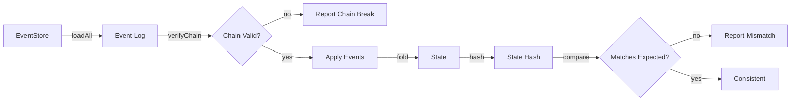

# 11 - Replay

Replay is the process of reconstructing system state by folding all events through the domain logic. It is both a correctness verification mechanism and the foundation of Synth's event-sourced architecture.

## What Replay Does

Replay takes the event log and reconstructs the canonical state:

```
state = emptyState()
for each event in eventLog (in order):
    state = applyEvent(state, event)
return state
```

This is the same process used by the RuntimeEngine when executing new intents -- it loads current state by replaying all existing events, then applies the new intent.

## Why Replay Matters

Replay serves multiple purposes:

1. **Correctness Verification** -- confirms that the event log and domain logic are consistent
2. **State Reconstruction** -- rebuilds state from the event log when needed
3. **Debugging** -- shows the exact sequence of changes that led to a state
4. **Audit** -- provides evidence that every state change is recorded
5. **Tamper Detection** -- detects if events were modified or corrupted

## Replay Flow



## Replay Engine

The replay engine performs the following steps:

1. **Load Events** -- read all events from the event store
2. **Verify Chain** -- check chain hash integrity (if chain hashes present)
3. **Initialize State** -- create empty state
4. **Apply Events** -- for each event, call `applyEvent(state, event)`
5. **Compute Hash** -- hash the resulting state
6. **Compare** -- match against expected hash

## Verification Report

The replay verifier produces a report containing:

| Field | Description |
|-------|-------------|
| consistent | Whether replay produced consistent state |
| eventCount | Number of events replayed |
| liveHash | Hash of the reconstructed state |
| expectedHash | Expected state hash (if available) |
| issues | List of any inconsistencies found |

## Failure Conditions

Replay can fail in the following ways:

### Chain Break

An event's `previousHash` does not match the preceding event's `eventHash`.

**Cause:** Event log tampering, storage corruption, or concurrent writes.

**Detection:** `EventStore.verifyChain()` reports the mismatch.

**Resolution:** Restore from backup. Investigate tampering.

### State Hash Mismatch

The reconstructed state hash does not match the expected hash.

**Cause:** Domain logic changed, event log corrupted, or nondeterministic execution.

**Detection:** Replay verifier reports hash mismatch.

**Resolution:**
- If domain logic changed: version the logic, replay with version-matched logic
- If event log corrupted: restore from backup
- If nondeterministic: identify and eliminate the nondeterministic source

### Invalid Entity State

An entity is in an impossible state (e.g., a work item with status "xyz").

**Cause:** Event log contains invalid events, or domain logic allows invalid transitions.

**Detection:** Entity validation during replay.

**Resolution:** Check event validity at the domain layer.

### Empty Event Log

The event log contains no events.

**Result:** Replay returns an empty state with hash "0". This is valid for a new system.

## Expected Guarantees

Replay provides the following guarantees:

| Guarantee | Description |
|-----------|-------------|
| Consistency | Same event log always produces the same state |
| Completeness | All events are replayed (none skipped) |
| Ordering | Events are replayed in log order |
| Detection | Tampering is detected via chain hash or state hash mismatch |
| Termination | Replay always terminates (finite event log) |

## Recovery

When replay detects an issue:

1. **Log the issue** -- record what was found
2. **Stop accepting mutations** -- prevent further corruption
3. **Analyze the issue** -- determine if it's tampering, corruption, or logic drift
4. **Restore from backup** -- if event log is corrupted
5. **Restart the system** -- with verified state

## Related Documents

- [09 - Event Model](09-event-model.md) -- Event structure and hash chaining
- [10 - Determinism](10-determinism.md) -- Determinism guarantees verified by replay
- [12 - State Model](12-state-model.md) -- State reconstruction details
