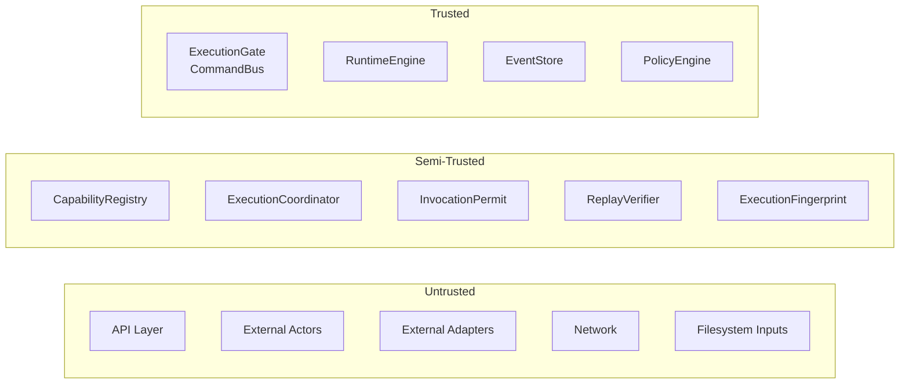

# 13 - Trust Boundaries

This document defines the trust model of Synth: which components are trusted, which are semi-trusted, which are untrusted, and the boundaries between them.

## Trust Zones

Synth has three trust zones:



## Trusted Components

These components constitute the trusted computing base (TCB). Their correct operation is assumed.

| Component | Role | Why Trusted |
|-----------|------|-------------|
| ExecutionGate (CommandBus) | Sole mutation authority | All mutations flow through it; it enforces validation, policy, and guard activation |
| RuntimeEngine | Pure execution operator | Executes domain logic without validation or policy; only receives pre-authorized invocations |
| EventStore | Append-only truth log | Persists all events with chain hashes; guarded writes prevent unauthorized appends |
| PolicyEngine | Deterministic constraint evaluator | Makes authorization decisions; frozen after seal to prevent tampering |

**Properties of Trusted Components:**
- They do not call into untrusted code during mutation
- They are frozen after bootstrap (where applicable)
- Their state is verifiable via hashes and attestations
- They are never directly exposed to external input without validation

## Semi-Trusted Components

These components are trusted to function correctly but do not have mutation authority.

| Component | Role | Trust Model |
|-----------|------|-------------|
| CapabilityRegistry | Capability metadata catalog | Read-only after seal; frozen |
| ExecutionCoordinator | Permit validation | Validates permits but cannot execute without them |
| InvocationPermit | Signed authorization token | Cryptographically bound to specific execution |
| ReplayVerifier | Consistency verification | Pure function of EventStore; detects tampering |
| ExecutionFingerprint | Determinism proof | SHA-256 of normalized execution record |

**Properties of Semi-Trusted Components:**
- They enhance verification but are not required for safety
- They operate on read-only or derived data
- Their output is independently checkable

## Untrusted Components

These components are NOT trusted. They may fail, be compromised, or behave maliciously without affecting kernel integrity.

| Component | Attack Surface | Mitigation |
|-----------|---------------|------------|
| API Layer | Receives all external requests | Validation → Policy → Permit → Guard |
| External Actors | May send arbitrary intents | Schema validation + policy engine |
| External Adapters | Input transformation | Untrusted; must pass through validation |
| Network | Transport layer | Not used by kernel; external concern |
| Filesystem Inputs | Persistence layer | Hash-verified on load |

**Key Invariant:** No untrusted component can mutate state without passing through all trusted layers.

## Boundary Definitions

### Boundary 1: API → ExecutionGate

```
[Untrusted: API request]
        ↓
[VALIDATE] -- rejects malformed input
        ↓
[Trusted: ExecutionGate]
```

- **What enters:** Actor, capability, payload (all validated)
- **What leaves:** InvocationPermit (signed), or rejection
- **What must be verified:** Input schema, actor identity, capability existence
- **What assumptions are allowed:** None; all inputs are validated

### Boundary 2: ExecutionGate → Runtime

```
[Trusted: ExecutionGate]
        ↓
[POLICY CHECK] -- rejects unauthorized intents
        ↓
[PERMIT CREATE] -- signs InvocationPermit
        ↓
[Semi-Trusted: ExecutionCoordinator] -- validates permit
        ↓
[Trusted: RuntimeEngine] -- executes
```

- **What enters:** Validated intent + signed permit
- **What leaves:** Domain result (events), transaction record
- **What must be verified:** Permit signature matches ExecutionGate key
- **What assumptions are allowed:** RuntimeEngine and ExecutionCoordinator are not subverted (structurally enforced)

### Boundary 3: Runtime → EventStore

```
[Trusted: RuntimeEngine]
        ↓
[GUARD ACTIVATE] -- token from CommandBus
        ↓
[Trusted: EventStore.append] -- hash-chained write
        ↓
[Persistence: Filesystem]
```

- **What enters:** Events with transaction IDs
- **What leaves:** Persisted events with chain hashes
- **What must be verified:** Guard token is active; events have txId
- **What assumptions are allowed:** Filesystem is append-only (enforced by L2 guard)

### Boundary 4: EventStore → State Reconstruction

```
[Persistence: Event log]
        ↓
[Trusted: rebuildState] -- pure fold
        ↓
[State hash] -- deterministic verification
```

- **What enters:** Event log (hash-verified)
- **What leaves:** Canonical state + state hash
- **What must be verified:** Replay hash matches stored hash
- **What assumptions are allowed:** rebuildState is a pure function

## Authority Boundaries

Authority flows downward through the system:

```
External Actor → API Layer → CommandBus → ExecutionCoordinator → RuntimeEngine
     (untrusted)  (untrusted)   (trusted)      (semi-trusted)      (trusted)
```

At each boundary, authority is reduced:
- External actors have no authority
- API Layer has authority to validate and forward
- CommandBus has authority to authorize and persist
- ExecutionCoordinator has authority to validate permits
- RuntimeEngine has authority to execute (but only pre-authorized invocations)

## Ingress Points

Data enters the system at two points:

| Ingress Point | Type | Validation |
|---------------|------|------------|
| `api.handleIntent()` | External request | Schema validation → Policy → Permit → Guard |
| `bus.dispatch()` | Direct dispatch (advanced) | Same pipeline as API |

There are no other ingress points for mutations.

## Egress Points

Data leaves the system at:

| Egress Point | Type | Content |
|--------------|------|---------|
| API response | External | Result, trace ID, fingerprint, attestation |
| EventStore persistence | Filesystem | Hash-chained event log |
| StateStore persistence | Filesystem | Hash-verified state snapshot |
| Verification reports | External | Consistency check results |

## Attack Surface

| Attack | Target | Result |
|--------|--------|--------|
| Direct Runtime call | Bypass ExecutionGate | **Prevented:** Runtime not exported |
| Direct EventStore write | Inject events | **Prevented:** Guard token required |
| Post-seal capability add | Expand attack surface | **Prevented:** Registry frozen |
| Post-seal policy change | Change governance | **Prevented:** Policy engine frozen |
| Tampered state file | Corrupt state | **Prevented:** Hash mismatch on load |
| Tampered event log | Corrupt history | **Detectable:** Chain hash verification fails |
| Invalid permit | Execute without authorization | **Prevented:** Coordinator rejects |
| API surface mutation | Runtime monkey-patching | **Prevented:** Objects frozen |

## Threat Model

Synth's threat model assumes:

1. **External actors are malicious** -- all inputs are validated
2. **Semi-trusted components may fail** -- but do not have mutation authority
3. **Trusted components are correct** -- verified by invariants and testing
4. **Persistence may be tampered with** -- hashes detect tampering
5. **Network is insecure** -- not used by the kernel
6. **Physical hardware is trusted** -- runs in a secure environment

## Related Documents

- [14 - Security](14-security.md) -- Security mechanisms and mitigations
- [17 - Runtime Invariants](17-runtime-invariants.md) -- Invariants that enforce trust boundaries
