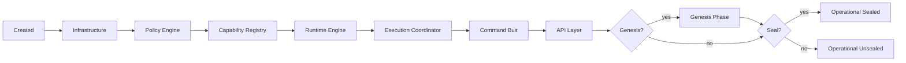

# 15 - Bootstrap and Genesis

This document describes the initialization sequence that creates a functional Synth system from nothing.

## Bootstrap Overview

Bootstrap is the process of creating, configuring, and wiring all system components into an operational execution kernel. It runs once at system startup and produces the complete system.

## Bootstrap Sequence

### Step 1: Create Infrastructure

Create the persistence layer:
- EventStore (append-only event log)
- StateStore (state snapshots with hash verification)
- PartitionStore (partitioned event streams)
- CheckpointStore (consumer group checkpoints)

Each store is initialized but empty.

### Step 2: Create Policy Engine

Create the policy engine with default policies:
- **System Protection:** Blocks destructive operations (DeleteSystem, ResetState, WipeData)
- **Completed Work Protection:** Blocks modification of completed work items

### Step 3: Create Capability Registry

Register all built-in capabilities:
- CreateWorkItem, StartWorkItem, CompleteWorkItem, BlockWorkItem
- CreatePlan, ActivatePlan, CompletePlan
- CreateMilestone, StartMilestone, CompleteMilestone
- CreateProject

### Step 4: Create Runtime Engine

Create the pure execution operator. This component:
- Is created within the bootstrap scope
- Is never added to the return value
- Is reachable only through the ExecutionCoordinator

### Step 5: Create Execution Coordinator

Create the permit validator with a unique 256-bit gate key. The coordinator:
- Shares the gate key with the CommandBus
- Validates InvocationPermits before delegating to Runtime
- Ensures Runtime never sees unverified invocations

### Step 6: Create Command Bus

Wire the single mutation authority:
- Connect to RuntimeEngine (through Coordinator)
- Connect to EventStore (guarded)
- Connect to PolicyEngine
- Connect to CapabilityRegistry
- Generate its own gate key for permit signing
- Must match the ExecutionCoordinator's gate key

### Step 7: Create API Layer

Create the public-facing request handler:
- Connects to CommandBus
- Validates incoming requests
- Formats responses with metadata

### Step 8: Genesis (Conditional)

If genesis configuration is provided:
- Create GenesisIntake with raw (unguarded) EventStore
- Write SYSTEM_GENESIS event
- Write initial projects
- Write initial tickets
- Return genesis result

## Genesis Phase

### What Genesis Does

Genesis populates the event log with initial system data before the execution pipeline is active. It is the only phase that writes events outside the guarded store.

### Why Genesis Exists

The system needs seed data (system identifier, initial entities) before it can accept operational commands. Genesis provides a privileged initialization phase that:
- Populates the event log without requiring the full execution pipeline
- Creates the initial system state
- Registers any seed capabilities

### Genesis Sequence

1. **Write SYSTEM_GENESIS event** -- marks system initialization
   - Contains: project name, system ID, partition count
   - Transaction ID: "genesis-tx"
   - Actor: "system"

2. **Write initial projects** -- PROJECT_CREATED events
   - One event per initial project
   - Contains: project ID, name, goal

3. **Write initial tickets** -- TICKET_CREATED events
   - One event per initial ticket
   - Contains: ticket ID, name, initial status

### Why Genesis Cannot Be Repeated

Genesis writes through the raw store, bypassing the guard. If genesis could be repeated after operational mode begins:
- Unguarded writes would be possible after seal
- I3 (no unauthorized mutation) would be violated
- The security model would be compromised

## Seal Phase

### What Seal Does

Seal is the one-way transition from flexible bootstrap mode to locked operational mode.

### Seal Sequence

1. **Freeze CapabilityRegistry** -- set `_frozen = true`, freeze internal Map
2. **Freeze PolicyEngine** -- set `_frozen = true`, freeze internal Map
3. **Freeze API** -- `Object.freeze(api)`
4. **Verify I1** -- confirm CommandBus is the single mutation authority
5. **Verify I5** -- confirm registry is immutable

### Seal Properties

- **One-way:** Cannot be undone without system restart
- **Optional:** System can operate unsealed (useful for development)
- **Irreversible:** Double-seal throws InvariantViolation
- **Verifiable:** `isSealed` property reports current state

### Why Seal Matters

An unsealed system allows:
- Registering new capabilities at runtime
- Registering new policies at runtime
- Modifying the API surface

These are useful for development but dangerous in production. Seal provides a clear, enforceable boundary between configuration time and runtime.

## Bootstrap Output

The bootstrap function returns the operational system surface:

| Component | Included | Notes |
|-----------|----------|-------|
| API | Yes | Public interface |
| CommandBus | Yes | For advanced direct dispatch |
| Infrastructure | Yes | Read-only access |
| PolicyEngine | Yes | Read-only after seal |
| CapabilityRegistry | Yes | Read-only after seal |
| ReplayVerifier | Yes | For verification |
| GenesisResult | Yes | If genesis ran |
| Seal function | Yes | One-way transition |
| isSealed | Yes | State indicator |
| RuntimeEngine | **No** | Internal only, not exported |

## Configuration

Bootstrap accepts configuration for:
- Infrastructure paths (event log, state file, etc.)
- Partition count
- Genesis data (initial projects, tickets)
- Policy overrides
- Capability extensions

## Error Handling

Bootstrap errors are fatal. If any step fails:
- Partial system is not returned
- All resources are cleaned up
- Error is reported with the failing step

## Related Documents

- [05 - Component Model](05-component-model.md) -- Component descriptions
- [06 - Execution Lifecycle](06-execution-lifecycle.md) -- Lifecycle states and transitions
- [17 - Runtime Invariants](17-runtime-invariants.md) -- Invariants verified during bootstrap

> **Historical Note:** Earlier versions of Synth used "Ticket" as the primary work tracking entity. The planning model now uses Mission → Expedition → Objective → Work Item. The event types `TICKET_*` are preserved as execution artifact projections. See [Terminology Migration Report](../reference/terminology-migration-report.md).
