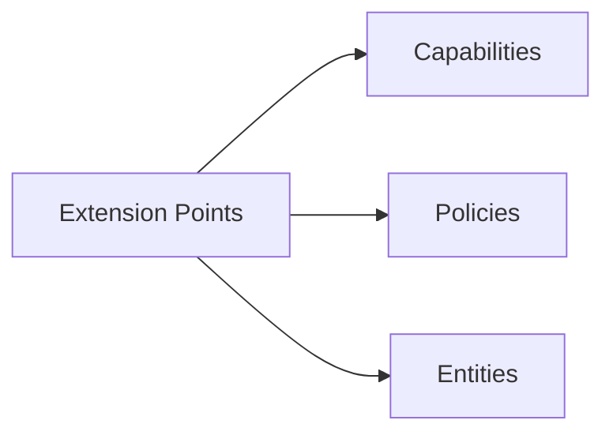

# 16 - Extension Model

This document describes how Synth can be extended with new capabilities, policies, and behaviors while preserving its architectural invariants.

## Extension Philosophy

Synth is designed to be extended, not modified. The distinction:
- **Extension:** Adding new capabilities and policies without changing existing ones
- **Modification:** Changing the kernel, domain logic, or invariants

Extensions are safe. Modifications require architectural review.

## Extension Points

Synth has three primary extension points:



## Extending Capabilities

### When to Add a Capability

Add a capability when the system needs to perform a new action that:
- Operates on existing or new entities
- Produces well-defined events
- Has clear preconditions
- Can be governed by policies

### How to Add a Capability

1. **Define the capability contract:**
   - Name (unique identifier)
   - Input schema (required and optional fields)
   - Output events (which event types are produced)
   - Preconditions (required system state)
   - Side effects (always true for domain capabilities)

2. **Implement domain logic:**
   - Entity constructor (if new entity type)
   - State transition function
   - Event emission logic
   - Invariant checks

3. **Register during bootstrap:**
   ```
   registry.register({
       name: "MyCapability",
       inputSchema: { types: { id: "string", field: "string" } },
       outputSchema: { events: ["MY_EVENT_CREATED"] },
       preconditions: [],
       sideEffects: true
   })
   ```

4. **Add policies if needed:**
   ```
   policyEngine.register({
       id: "my-capability-governance",
       name: "My Capability Governance",
       scope: { capabilities: ["MyCapability"] },
       condition: (intent, state) => { /* check */ },
       effect: "DENY",
       severity: "high",
       enabled: true
   })
   ```

### Capability Naming Conventions

- Use PascalCase: `CreateWorkItem`, `StartMilestone`
- Use verb-noun format: action + entity
- Keep names stable (changing a name is a breaking change)

## Extending Policies

### When to Add a Policy

Add a policy when:
- A capability needs governance constraints
- A class of actions should be restricted
- Compliance requirements must be enforced

### How to Add a Policy

1. **Define the policy:**
   - ID (unique identifier)
   - Scope (which capabilities and actors it applies to)
   - Condition (when the policy matches)
   - Effect (ALLOW or DENY)
   - Severity (precedence order)

2. **Register during bootstrap:**
   ```
   policyEngine.register({
       id: "my-policy",
       name: "My Policy",
       scope: { capabilities: ["StartWorkItem"], excludeActors: ["admin"] },
       condition: (intent, state) => state.tickets[intent.payload.id]?.status === "blocked",
       effect: "DENY",
       severity: "high",
       enabled: true
   })
   ```

### Policy Best Practices

- Use DENY for restrictions, ALLOW for permissions
- Set severity proportional to risk
- Use conditions that are deterministic and pure
- Document the rationale for each policy

## Extending Entities

### When to Add an Entity

Add an entity when the system needs to track a new type of object with:
- Its own lifecycle (states and transitions)
- Its own events
- Its own capabilities

### How to Add an Entity

1. **Define the entity structure:**
   - ID field
   - Status/state field
   - Metadata fields
   - Relationship fields (if applicable)

2. **Implement lifecycle functions:**
   - Constructor
   - State transition functions
   - Validation functions

3. **Add event types:**
   - ENTITY_CREATED
   - ENTITY_UPDATED
   - ENTITY_<transition>

4. **Add capabilities:**
   - CreateEntity
   - UpdateEntity
   - TransitionEntity

5. **Add event application handlers:**
   - Handle each event type in the state reconstruction logic

## What Cannot Be Extended

The following cannot be changed without modifying the kernel:

| Component | Why Protected | How to Change |
|-----------|--------------|---------------|
| CommandBus | Single mutation authority | Architectural change |
| RuntimeEngine | Pure execution operator | Architectural change |
| ExecutionCoordinator | Permit validation logic | Architectural change |
| EventStore append semantics | Append-only guarantee | Architectural change |
| Guard mechanism | Write protection | Architectural change |
| Invariant I1-I5 | Core guarantees | Architectural change |

## Extension Safety Rules

1. **Never bypass the CommandBus** for mutations
2. **Never modify events after they are written**
3. **Never change domain logic in ways that affect historical events**
4. **Never add nondeterministic behavior to the domain**
5. **Always register capabilities before seal**
6. **Always register policies before seal**
7. **Always test replay after adding capabilities**

## Future Plugin Support

The capability model is designed to support dynamic plugins in future versions:

- Capabilities can be loaded from external definitions
- Domain logic can be registered at runtime (before seal)
- Policy rules can reference capabilities by name
- The freeze-after-seal mechanism ensures stability

A plugin system would:
1. Load capability definitions from external files
2. Register them with the CapabilityRegistry during bootstrap
3. Load policy definitions and register them with the PolicyEngine
4. Seal the system before operational mode

## Related Documents

- [07 - Capability Model](07-capability-model.md) -- How capabilities work
- [08 - Governance](08-governance.md) -- How policies govern capabilities
- [05 - Component Model](05-component-model.md) -- Component descriptions
